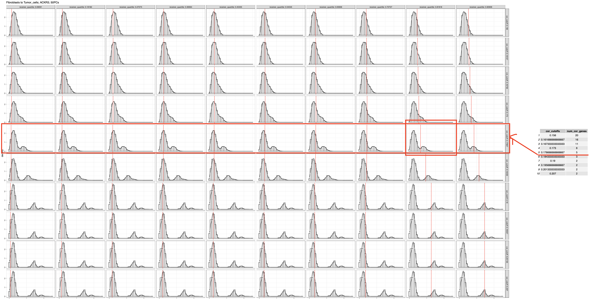

<h2> : Inferring Cell-cell Interaction from Spatial Transcriptomics Data </h2>

## Introduction
Multicellular organisms heavily rely on cell-cell interactions to effectively coordinate and regulate various biological processes, ensuring the normal functioning of the organism. Spacia models and evaluates cell-cell interactions from spatial transcriptomic data (SRT). This model uses cell-cell proximity as a constraint and prioritizes cell-cell interactions that cause a downstream change in the cells. Spacia employs a Bayesian multi-instance learning (MIL) framework to assess intercellular communication between cells and their neighbors.

## Graphical abstract


## Installation
This project requires R and Python with the following dependencies:

### Dependency
- R: R>=4.0.5
- Python: Python>=3.8
  
#### R Packages:
- coda==0.19-4
- ggmcmc==1.5.1.1
- Rcpp==1.0.9
- RcppArmadillo==0.11.2.3.1
- rjson==0.2.21
  
#### Python Packages:
- matplotlib==3.7.2
- pandas==2.0.3
- scipy==1.10.1
- scikit-learn==1.3.0
- numpy ==1.24.3

We strongly recommend using conda to manage the installation of all dependencies. To set up the environment and install specific versions, run the following commands:

```bash
conda create --name spacia
conda activate spacia
# conda config --add channels conda-forge # If you do not have this channel added before
conda install r-base=4.0.5 r-coda=0.19-4 r-ggmcmc=1.5.1.1 r-rcpp=1.0.9 r-RcppArmadillo=0.11.2.3.1 r-rjson=0.2.21
conda install python=3.8 pandas=2.0.3 scikit-learn=1.3.0 numpy=1.24.3 scipy=1.10.1 matplotlib=3.7.2
```

Then, download this repo.
```
git clone [repo_path]
```

The total installation time is around 10 minutes. If an error occurs, please upgrade pip and try again.

**Note**: If you are on a macOS and do not have the Xcode Command Line Tools installed, please do so by running `xcode-select --install` in terminal.

## Test installation
Test Spacia using a simple test script by:

```python test.py```

The output should look like this 

```
Testing Spacia with a single gene as response feature and simple aggregation
Test Succeeded.
Testing Spacia with multiple genes as response feature and no agg mode
Test Succeeded.
Testing Spacia with multiple genes as response feature and pca agg mode
Test Succeeded.
```

**Note**: You may get some warning messages from the Rcpp package, but this does not affect the performance of the software.

### About the test data

The test data is a randomly generated dataset for the purpose of validating the installation only.

The test itself contains ~2,500 cells and it should finish in 5 minutes.

The purpose of the test is only to validate the installation, and the there is no interpretation associated with the test results.

We have also included the simulation dataset used in our manuscript in `/data/simulation`

## Usage

### Definition of terms used in Spacia
**Interaction**: Relationship between a pair **interactants** that potentially leads to downstream signalling events in cells. The **interactant** can be a gene or a geneset.

**Signal**: The **interactant** in the **interaction** that is causing downstream signaling events.

**Response**: The **interactant** in the **interaction** whose expression is changed as the result of activities from **Signal**.

**Sender**: A cell where the **Signal** is expressed.

**Receiver**: A cell where the **Response** is expressed. 

**Neighborhood**: A regions centering around each **Receivers** that contains **Senders** of interest.

### Quick start
Once the input data have been processed into the supported format, the full Spacia workflow can be run by calling the `spacia.py` script. It evaluates interactions within the context of cell neighborhoods, where the ‘**receiver**’ cells are the cells of interest, and the cells from the neighborhood are referred to as "**sender**" cells. The **interactant** expressed in the receiver cells, through which the interactions are to be studied, are referred to as "**Response**", while the **interactant** expressed in the sender cells that potentially influence the responder genes are called signal “**Signal**".

```
python [path/to/spacia.py] counts.txt cell_metadata.txt -rc celltype1 sc celltype2 -rf gene1 sf gene2
```

Here, `counts.txt` is a cell-by-gene matrix in TX format. We expect the data to be normalized as log1p(cpm).

`cell_metadata.txt` is a cell_by_metadata matrix in txt format in TXT format. Must contains `X` and `Y` columns for coordinates, and a `cell_type` column, referring to the group designation of cells, is needed if '-rc' or '-sc' parameters are given.

`-rc` and `-sc` refer to **receiver** cells and **sender** cells, respectively.

`-rf` and `-sf` refer to **Response** and **Signal** features. Here they are in form of single genes. Spacia can also take pathways in the format of a list of genes as input features. 


### Processing **interactant** expression
**Spacia employs several different workflows to calculate **interactant** expression in cells, aiming to handle use cases of different purposes. The behavior is controlled largely by the `--receiver_features` and `--sender_features` parameters, and a few others to a lesser extent.**
* Spacia evaluates **interactions** in the contexts of **receiver** and **sender** cells. Instructions regarding this can be passed to `--receiver_cluster` or  `--sender_cluster`, if cluster labels are available in the cell_by_metadata matrix. Alternatively, the cell ids of both **receiver** and **sender** cells can be passed using a csv file by passing the file name to `--cellid_file`. The cell id csv file has two columns with no headers corresponding to **receiver** and **sender** cells, respectively.
* When the **interactant** is a single gene, Spacia can try to mitigate noises associated with gene expression in SRT data by considering the expression of highly correlated genes (by absolute Pearson correlation values). This behavior can be turned off by passing the `--corr_agg` keyword. The number of highly correlated genes to consider can be changed by passing the desired number to the `--num_corr_genes` keyword. The new expression value considering these correlated genes can be calculated as the weighted average of their expression, whereas the weights are the Pearson correlation coefficients with the gene of interest. In cases where only the positively correlated genes should be considered, Spacia will only include the top positively correlated genes to calculate the expression of the **interactant**. This behavior can be set by passing `--corr_agg_method simple`.
* When the **interactant** contains several genes, Spacia will no longer use correlation based aggregation, instead, the average of the inputs genes will be calculated and used as the expression of the interactant.
The list of genes can be passed as a string separated by "|", e.g., 'CD3E|CD4|CD8A'. It can be also passed by csv files, with each gene list as a separate row, where the first element is the name of the gene list. These parameters should be passed to `--receiver_features` or `--sender_features`.
* Spacia can also be run in two unsupervised modes where the **interactant** is not provided. In the first unsupervised mode, Spacia will transform the SRT data using the first 20 principal components, and use the transformed dimensions as **interactants**. ****This mode is not recommended for response genes, as the interactions predicted in this way are difficult to interpret.**** This mode can be set by passing `pca` to `--receiver_features` or `--sender_features`. In the second unsupervised mode, Spacia will cluster the genes in the SRT data using hierarchical clustering and use the expression value of each cluster centroid as the **interactions**. This mode can be set by not passing any parameters to `--receiver_features` or `--sender_features`.

#### A summary of important parameters mentioned above
`--receiver_features` and `--sender_features`: Controls the **interactants** in Spacia, can be a single gene, a set of genes separated by "|", `pca` for the first unsupervised mode, or left blank for the second unsupervised mode.

`--receiver_cluster` and `--sender_cluster`, `--cellid_file`: Controls the cellular contexts of **interactants** in Spacia. `--receiver_cluster` and `--sender_cluster` must be cluster names present in metadata, if these are left blank, `--cellid_file` must be provided.

 `--corr_agg`, `--num_corr_genes` and `--corr_agg_method`: Determines how the gene expression is aggregated. 

#### List of other important parameters
`--dist_cutoff` or `--n_neighbors`: Determines the radius of the neighborhood around each receiver cell. Can be passed as an exact number to `--dist_cutoff` or estimated based on the required number of neighbors given by `--n_neighbors`.

`--bag_size`: The minimal size of each bag in the MIC model, i.e., the minimal number of **sender** cells within each **receiver** cell's neighborhood.

`--number_bags`: The number of bags used in the MIL model.

`--mcmc_params`: Advanced hyperparameters for the MIL model.

`--output_path`: Output folder for Spacia.

#### Output file format
The primary output of Spacia is a set of files containing a high level summary of the final results. These files are `B_and_FDR.csv`, `Pathway_betas.csv`, and `Interactions.csv`.

`B_and_FDR.csv` contains the **b** values of each response gene/pathway (first column) and the associated significance information.

`Pathway_betas.csv` contains the **beta** values representing the interaction between each response gene/pathway (first column) and signal gene/pathway (second columns).

`Interactions.csv` contains the primary instance scores of all receivers in each receiver-sender cell pair (second and third column) for each response-signal interaction (first column). 

### For advanced users

(1) Spacia also saves the intermediate results in each `Response_name` folder, which are summarized into the primary output. These files include:

Diagnostic plots in pdf formats reporting the behavior of each MCMC chains.

Values of **b** and **beta** as calculated during each MCMC iteration/chain. `[Response_name]_[b/beta].txt`

Primary instance scores between each receiver and sender, in long format. To decode this, please refer to the `model_input/metadata.txt` file, and flatten the `Sender_cells` column. You can do this in `Pandas` using the `str.split` and `explod` functions.

(2) For users who want to directly access the core of Spacia and perform more flexible analyses (we strongly encourage you to do so) , we provide an example R script that showcases the few key steps. But please regard the codes in this R script as examples and remember to customize everything according to your needs/datasets. This script showcases our suggested pipeline of data processing, and the codes should be self-explanatory enough. Our analysis codes of the prostate Merscope data (Fig. 4) are derived based on this R script. But the major pre-processing, inference, and post-processing steps shown in this R script are overall consistent with those in our main Spacia API. We expect different SRT technologies to generate data in different formats and vary in quality. For maximum performance, we suggest that users perform data pre-processing and thorough quality filtering on their own, then massage the filtered data to the right format to feed into the core of Spacia. We also provide example data and parameters under `test/input/rscript_test_data` to test the R script. Note that the data and parameters used in the example below is only intended for a quick test and does not produce stable or usable output. For real data, users should use parameters closer to the default values, where possible, and expect higher resource usage and computation time.

```
export dir=[path/to/Spacia]
Rscript $dir/spacia.R \
	-x $dir/test/input/rscript_test_data/example_counts.csv -C \
	-m $dir/test/input/rscript_test_data/example_meta.csv \
	-a $dir/Spacia \
	-r Tumor_cells -s Fibroblasts -g ACKR3 \
	-q 0.76 -u 0.179 \
	-l 5000 -w 2500 \
	-o $dir/test/rscript_test/
```
Use `-h` or `--help` to see detailed descriptions of options and inputs. 

##### Determining cutoffs
The R script requires the receiving gene cutoffs as inputs since the same process was used for the prostate Merscope data. To determine the cutoffs, simply omit the relevant options (`-q`, `-u`, and `-t`) and plots will be generated and saved to a pdf. First, find the correlation cutoff (for `-u`) by looking for the first row of plots that displays a bimodal distribution. Then, the quantile cutoff (`-q`) can be found by picking the column where the vertical red line most cleanly seperates the two distributions. 


Different cutoffs must be used for different combinations of receiving cell and receiving gene, and we recommend finding new cutoffs for each sending cell type as well. The included [cutoffs](test/input/rscript_test_data/gene_cutoffs.csv) corresponds to fibroblasts as sending cells and tumor cells as receiving cells. This process is automated in the main `spacia.py` if `--response_exp_cutoff 'auto'` is used. 

#### Outline for large scale runs
Consider following these steps if running Spacia on a large scale (e.g. screen for all potential cell-to-cell communications in a MERSCOPE or CosMx dataset).

##### (1) Format and pre-process data. 

We highly recommend users perform their own quality control and normalization. Spacia will perform rudimentary normalization if `-C` option is used, but will not perform any filtering. Cell types must be determined and present in the meta data csv, and cell names must be consistent between the inputs.

##### (2) Determine the scope of the analysis. 

Due to costs in time and computation, we recommend users limit their analysis to cell types and genes of interest if possible. Note that `spacia.R` runs in the 'PCA' mode, thus its performance is not greatly affected by the number of genes in the input data and genes should not be removed to imporve performance. However, since each run consists of a combination of sending cell type, receiving cell type, and receiving gene, we recommend users at least limit the list of receiving genes to the most highly expressed genes in the receiving cells of interest in order to reduce the total number of Spacia jobs. For example, in our analysis of stromal to tumor interactions in prostate Merscope data, we chose the top 200 most highly expressed genes in tumors out of the 500 total genes available as the prospective receiving genes. 

##### (3) Determine receiving gene cutoffs.

Run Spacia with a list of receiving genes as input for `-g`, with one output directory for each receiving cell type. We recommend organizing the output directory in the form of `mainOutputDir/receivingCellType/sendingCellType/`, although `spacia.R` will prefix output files with `sendingCellType-receivingCellType_receivingGene`, making it possible to use just one output directory. If the path passed to `-o` ends in `/`, it will be interpreted as a directory, otherwise it is considered a prefix. Though not optimal, it is acceptable to re-use cutoffs for interactions involving different sending cell types if they share the same receiving cell type. Determine and record the cutoffs for the desired receiving genes in seperate csv files for each receiving cell type as detailed in the `Determining cutoffs` section above.

##### (3) Parallelization.

Spacia jobs are independent of each other and can be run on different systems simultaneously. If a shared filesystem is available for output, users can simply run multiple instances of Spacia with the same output directory for each sending-receiving cell combination and leave `-g` blank, in which case the script will loop through all receiving genes in the corresponding csv entered for `-t` and use lock files to avoid duplicate runs. Otherwise, manually divide the receiving genes for each cell type combination and provided these different lists as inputs for `-g` for seperate runs. After testing, we found that multiprocessing often results in longer overall run time for `spacia.R`, and we therefore did not include multiprocessing capability in the script. We do not recommend running more than two `spacia.R` instances in parallel on one system, and systems with less than 20 physical CPU cores should only run jobs sequentially. This means that it is best to spread jobs to as many systems as possible. Since the memory requirement of each job is relatively low compared with similar tools, Spacia can scale using systems with lower memory capacity, which is often a limiting resource in HPC or shared computing environments.

### Contact Us
If you have any suggestions/ideas for Spacia or are having issues trying to use it, please don't hesitate to reach out to us.

Noah Chang, wooyong.chang@utsouthwestern.edu

James Zhu, james.zhu@utsouthwestern.edu

Yunguan Wang, yunguan.wang@cchmc.org

